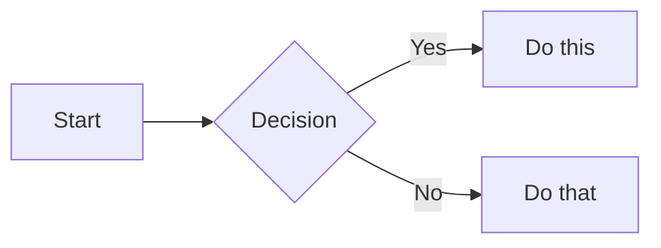

# Markdown Cheat Sheet (GitHub Flavoured)

---

## Headings

```markdown
# Heading 1
## Heading 2
### Heading 3
#### Heading 4
##### Heading 5
###### Heading 6
```

---

## Text Formatting

```markdown
**Bold text**
*Italic text*
***Bold and italic***
~~Strikethrough~~
`Inline code`
> Blockquote
>> Nested blockquote
```

**Bold text**
*Italic text*
***Bold and italic***
~~Strikethrough~~
`Inline code`

> Blockquote
>> Nested blockquote

---

## Links

```markdown
[Link text](https://www.example.com)
[Link with title](https://www.example.com "Hover title")
<https://www.example.com>              <!-- Auto-link -->
[Reference link][1]

[1]: https://www.example.com "Reference style"
```

---

## Images

```markdown


<!-- Resize (GitHub only renders HTML img tags) -->

```

> **Tip:** GitHub doesn't support markdown image resizing.
> Use the `` HTML tag with a `width` attribute instead.

---

## Lists

### Unordered

```markdown
- Item 1
- Item 2
  - Sub-item 2a
  - Sub-item 2b
    - Sub-sub-item
```

### Ordered

```markdown
1. First item
2. Second item
3. Third item
   1. Sub-item 3a
   2. Sub-item 3b
```

### Task List (GitHub specific)

```markdown
- [x] Completed task
- [ ] Incomplete task
- [ ] Another task
```

- [x] Completed task
- [ ] Incomplete task
- [ ] Another task

---

## Code

### Inline Code

```markdown
Use the `print()` function.
```

### Fenced Code Block (with syntax highlighting)

````markdown
```python
def hello():
    print("Hello, World!")
```

```javascript
const greet = () => console.log("Hello!");
```

```bash
echo "Hello from the terminal"
```
````

### Indented Code Block (4 spaces)

```markdown
    def hello():
        print("Hello, World!")
```

> **Common language identifiers:** `python`, `javascript`, `typescript`,
> `bash`, `json`, `yaml`, `html`, `css`, `sql`, `java`, `c`, `cpp`,
> `csharp`, `go`, `rust`, `markdown`, `diff`, `xml`

---

## Tables

```markdown
| Left Aligned | Centre Aligned | Right Aligned |
|:-------------|:--------------:|--------------:|
| Row 1 Col 1  | Row 1 Col 2    | Row 1 Col 3   |
| Row 2 Col 1  | Row 2 Col 2    | Row 2 Col 3   |
| Row 3 Col 1  | Row 3 Col 2    | Row 3 Col 3   |
```

| Left Aligned | Centre Aligned | Right Aligned |
|:-------------|:--------------:|--------------:|
| Row 1 Col 1  | Row 1 Col 2    | Row 1 Col 3   |
| Row 2 Col 1  | Row 2 Col 2    | Row 2 Col 3   |

> **Alignment:** `:---` left, `:---:` centre, `---:` right

---

## Horizontal Rules

```markdown
---
***
___
```

---

## Blockquotes

```markdown
> Simple quote

> Multi-line quote
> continues here

> **Tip:** You can nest other elements inside quotes
> - Like lists
> - And `code`
```

---

## Escaping Special Characters

```markdown
\*Not italic\*
\# Not a heading
\- Not a list item
\[Not a link\]
\`Not code\`
```

Characters that can be escaped: `` \ ` * _ { } [ ] ( ) # + - . ! | ``

---

## GitHub-Specific Extensions

### Alerts / Admonitions (GitHub)

```markdown
> [!NOTE]
> Useful information that users should know.

> [!TIP]
> Helpful advice for doing things better.

> [!IMPORTANT]
> Key information users need to know.

> [!WARNING]
> Urgent info that needs immediate attention.

> [!CAUTION]
> Advises about risks or negative outcomes.
```

### Emoji

```markdown
:smile: :thumbsup: :rocket: :warning: :white_check_mark: :x:
```

:smile: :thumbsup: :rocket: :warning: :white_check_mark: :x:

### Mentioning Users and Issues

```markdown
@username                  <!-- Mention a user -->
#123                       <!-- Link to issue/PR #123 -->
organisation/repo#456      <!-- Cross-repo issue reference -->
```

### Footnotes

```markdown
Here is a sentence with a footnote.[^1]

[^1]: This is the footnote content.
```

### Collapsed / Details Section

```markdown
<details>
<summary>Click to expand</summary>

Hidden content goes here.

- Can include **any** markdown
- Lists, code, images, etc.

</details>
```

<details>
<summary>Click to expand</summary>

Hidden content goes here.

- Can include **any** markdown
- Lists, code, images, etc.

</details>

### Mermaid Diagrams (GitHub renders these)

````markdown

````

---

## Quick Reference Table

| Element          | Syntax                                 |
|:-----------------|:---------------------------------------|
| Heading          | `# H1` `## H2` `### H3`              |
| Bold             | `**text**`                             |
| Italic           | `*text*`                               |
| Strikethrough    | `~~text~~`                             |
| Inline code      | `` `code` ``                           |
| Link             | `[text](url)`                          |
| Image            | ``                          |
| Unordered list   | `- item`                               |
| Ordered list     | `1. item`                              |
| Task list        | `- [x] done` / `- [ ] todo`           |
| Table            | `\| col \| col \|`                     |
| Code block       | ` ``` language ... ``` `               |
| Blockquote       | `> text`                               |
| Horizontal rule  | `---`                                  |
| Footnote         | `[^1]` / `[^1]: text`                 |
| Collapsed        | `<details><summary>...</summary>`      |
| Escape character | `\*`, `\#`, `\[`, etc.                |

---

*Created for GitHub-flavoured Markdown (GFM). Open this file in VS Code and press `Ctrl+Shift+V` (Windows) or `Cmd+Shift+V` (Mac) to preview.*
